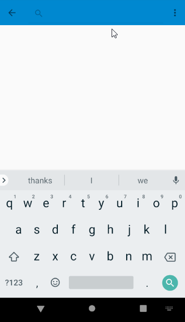

# Book Search App
This Android app implements the extensions below to the original base application provided by CodePath. 

## Extensions Implemented

- [x] Use SearchView to search for books with a title
- [x] Show ProgressBar before each network request
- [x] Add a detail view to display more information about the selected book from the list
- [x] Use a share intent to recommend a book to friends

# Original CodePath Application:
 This is an Android app that leverages the [OpenLibrary API](https://openlibrary.org/developers/api) to search books and display cover images. This app is to be used as the base app for adding suggested extensions.
 
## Overview

The app does the following:

1. Fetch the books from the [OpenLibrary Search API](https://openlibrary.org/dev/docs/api/search) in JSON format
2. Deserialize the JSON data for each of the books into `Book` objects
3. Build an array of `Book` objects and notify the adapter to display the new data. 
4. Define a view holder so the adapter can render each book model. 

To achieve this, there are four different components in this app:

1. `BookClient` - Responsible for executing the API requests and retrieving the JSON
2. `Book` - Model object responsible for encapsulating the attributes for each individual book
3. `BookAdapter` - Responsible for mapping each `Book` to a particular view layout
4. `BookListActivity` - Responsible for fetching and deserializing the data and configuring the adapter

## Usage
This app is intended to be the base project on top of which new features can be added. To use it, clone the project and import it using the following steps:

## Libraries

This app leverages two third-party libraries:

 * [AsyncHttpClient](https://github.com/codepath/AsyncHttpClient) - For asynchronous network requests
 * [Glide](https://github.com/bumptech/glide) - For remote image loading
